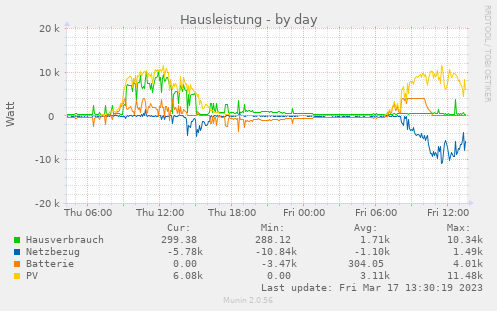

# wallbox

 

(Scroll down for an explanation of the images)

## Important note

The code that adjusts the charging power HAS RECEIVED COMPARATIVELY LITTLE
TESTING YET. 

After using it myself for a few weeks now and fixing a few critical bugs, I now
consider this code base stable enough to be running unsupervised. I am still
not making any guarantees, however (also do check the LICENSE file, please)

## What is it?

EV vehicle charging management. Charge your car with the surplus
energy of your PV system. Read out and log the parameters of your
energy meter. Monitor your residual current monitor system. I'm
developing this for my own purposes. The name is a bit of a misnomer,
as only one component is concerned with the wallbox.

This tool has multiple subcommands. They are:

  * wallbox-manager           Charge your electric car with your PV
                              system's surplus energy
  * energy-meter              Read out, make available and log your
                              energy meter's measurements
  * decompress-stream         Decompress incomplete gzip streams
  * residual-current-monitor  Monitor and logresidual currents and
                              take action when defined thresholds are
                              exceeded (Work in progress!) 

This tool is (currently) fixed to the following hardware that I own
myself (physically, it doesn't mean that it runs free software).
Specifically:

* An E3DC PV system, S10 X Compact
* A Mennekes Amtron Charge Control electric vehicle charger (the 11kW flavour)
* A Siemens PAC2200 energy meter with integrated transducers
* A Doepke DCTR B-X Hz residual current monitoring system

## Getting started

Run ``cargo build --release`` to build the release. (I'm using the musl flavor
to build a static binary that I can deploy to my "solar router" -- an APU2 with
wifi for uplink and some ports to connect the EV charger+PV system to)

Then have a look at ``wallbox.toml``. Edit the file to suit your needs.

Do contact me at hc-solarstrom@hce.li for comments, questions etc. :-)

## Explanation of the munin images

The first image shows the computed surplus power available and the
power used by the electric vehicle to charge.

The second image shows the PV power available, the power used in the
house, the power exported/imported to the power grid and the power
used to charge/decharge the PV batteries. On day one, the electric
vehicle was connected to the charging outlet. You can see that the
power consumed in the house (which includes the EV charging power) is
constantly adjusted based on the PV power available. On the second
day, the EV is not charging, so at first the PV battery charges
(limited to 0.3C/4kWh), then all power not consumed locally is
exported to the power grid.

## Example log

To illustrate what it does, here is a small log excerpt from my first test
a few days ago:

    [2023-02-22][12:57:24][wallbox::wallbox_manager][INFO] Vehicle connected: Maria
    [2023-02-22][12:57:24][wallbox::mennekes][INFO] Vehicle Maria connected for less than 180 seconds, signalling 8 amps
    [2023-02-22][13:02:43][wallbox::mennekes][INFO] Some excessive power is available, increasing charging current by 1 amp to 9A
    [2023-02-22][13:03:43][wallbox::mennekes][INFO] Some excessive power is available, increasing charging current by 1 amp to 10A
    [2023-02-22][13:04:44][wallbox::mennekes][INFO] Some excessive power is available, increasing charging current by 1 amp to 11A
    [2023-02-22][13:15:19][wallbox::mennekes][INFO] Available PV power of 2293Watts is less than minimum charging power of 2300Watts. Halting charging.
    [2023-02-22][13:20:33][wallbox::mennekes][INFO] Some excessive power 3150W is available, increasing charging current to 8A
    [2023-02-22][13:33:20][wallbox::mennekes][INFO] Available PV power of 1466Watts is less than minimum charging power of 2300Watts. Halting charging.
    [2023-02-22][13:50:53][wallbox::wallbox_manager][INFO] Vehicle disconnected (Maria)
    [2023-02-22][13:50:54][wallbox::mennekes][INFO] No vehicle connected, setting MAX_AMPS to the configured default of 8A
    
    

